

****

> This article is adopted from fireflyMigration

# Collaborate on Code in GitHub

In this lesson we will learn how to collaborate and contribute to code written in a team environment.

## Create a Fork on GitHub

- Open a web browser to the GitHub project page (i.e. https://github.com/FireflyMigration/firefly-doc).

- Make sure you have a GitHub account and that you are logged in (your user avatar should appear at the top right corner)

- Click on the "Fork" button in the upper right corner.

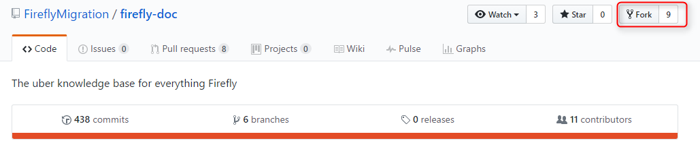

This creates a copy of the repository under your GitHub account which you have read and write access.

## Clone the forked repository

- In Team Explorer, click on Manage Connections. Expand Local Git Repositories.

- Clone your forked repository to your local machine.

- This creates a local clone of your repository with the cloud repository is configured as the default remote named "origin"

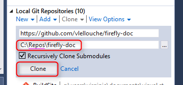

> Notice that this is your own copy of the repository connected to the fork and not the main repository.

## Keeping your fork up to date with the main repository

### Create "upstream" remote

- In Team Explorer, click on the Home button

- Click on Settings

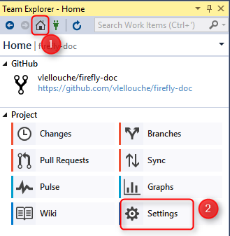

- Click on "Repository Settings" hyper-link

- Under "Remotes" sub-menu, click "Add" hyper-link

- Enter "upstream" in the name and the main repository url (i.e. https://github.com/FireflyMigration/firefly-doc) in Fetch

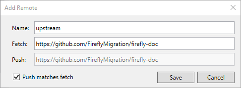

- Click Save

This create a connection to the main repository named "upstream" that will allow us to get the latest change from it.

### Pulling updates from the main (upstream) repository

Sooner or later, the main repo will have updates that you will want to pull into your fork.
If you go to your fork's GitHub web page you will see that there is a line just before the description of the files in the repo that indicates if your fork is ahead, behind or in sync with the master branch of the original repo.
To pull the latest changes and bring your fork up date:

- In Team Explorer, click on the Home button

- Click on Sync

- Click on Fetch

- In the combo-box select upstream

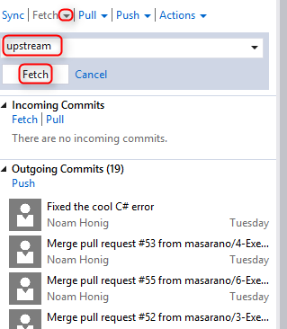

This will fetch all the changes from the "upstream" repository and put them in the **LOCAL** repository.

> Notice that this does not change any existing branch.

### Merging the changes from upstream/master branch into the local master branch

- In Team Explorer, click on the Home button

- Click on Branches

- Make sure that master is the active branch (it should be bold). If not double click on master to make it the active branch. You may have to commit all the current changes before you can switch branches.

- Right click the master branch and select "Merge from..."

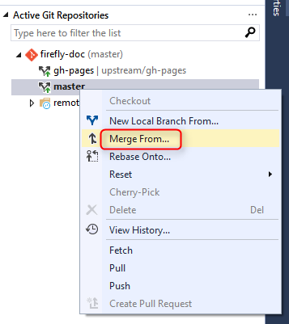

- Select upstream/master in "Merge from branch:"combo-box

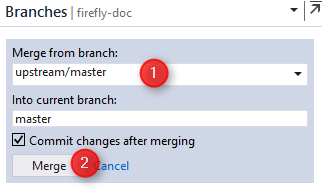

- Click Merge

### Pushing the local repository to your GitHub fork

- In Team Explorer, click on the Home button

- Click Sync

- Click on the "Push" hyper-link

- Select "origin" in the first combo-box

- Select "master" in the second combo-box

- Click Push

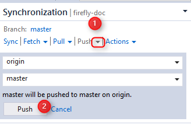

- Go to your GitHub web page for the fork and make sure that you see a line that says: "This branch is even with FireflyMigration:master."

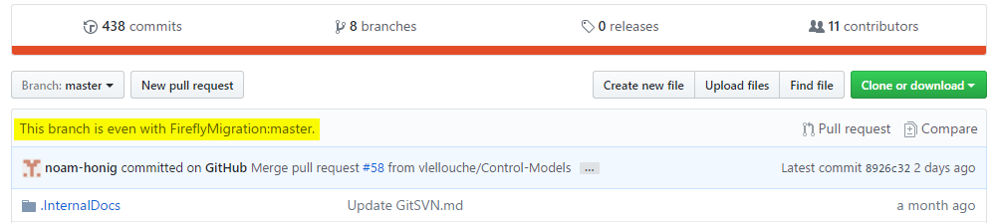

## Contributing to the main repository using Pull Request

Creating a pull request to the main repository starts by creating a local branch for your work and pushing this branch to your GitHub fork.

At this point, you should already be up-to-date with the main repository.

### Create a local branch

- In Team Explorer, click on the Home button

- Click on Branches

- Right click on master and select "New Local Branch From..."

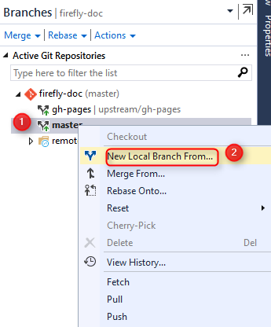

- Enter a branch name

- Select "master" in the combo-box

- Click on Create Branch button

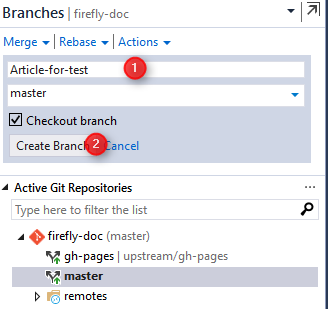

### Publish the branch

Once your work is done and committed to your local new branch you need to push it to the GitHub fork

- In Team Explorer, click on the Ho

- Click on Branches

- Right click your new branch and select "Publish Branch"

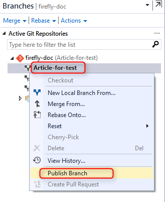

This creates a new branch in your GitHub Fork that is tracked by the local branch with the same name.

### Create a pull request

- Click on View -> Other Window -> Github

- Click on Create New

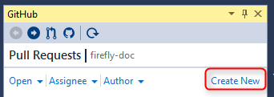

- Select FireflyMigration:master < Name of the new branch

- Click on Create pull request button

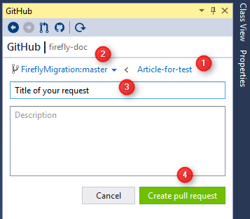

****

****

<noscript>Please enable JavaScript to view the <a href="https://disqus.com/?ref_noscript">comments powered by Disqus.</a></noscript>