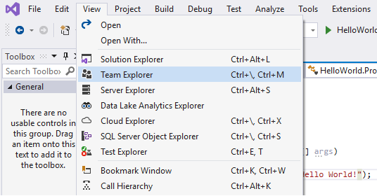

****

# Publishing a Visual Studio project to GitHub

In this lesson, we will publish an project on Visual Studio to GitHub.

- Using Visual Studio, create a C# Console Application (.NET Core). Refer to the link on how to create a [Console Application](https://csharpfoundation.tutorial.rclapp.com/lessons/lesson1.html).

- If solution is not already initialized as a Git repository, select Add to Source Control from the File menu.

- Open Team Explorer.

- In Team Explorer, click Sync.

- Click the Publish to GitHub button.

- Sign in to GitHub. 

- Select your GitHub account

- Enter a name and description for the repository on GitHub.

- Click the Publish button.

- Verify the project is published on GitHub

****

****

<noscript>Please enable JavaScript to view the <a href="https://disqus.com/?ref_noscript">comments powered by Disqus.</a></noscript>

