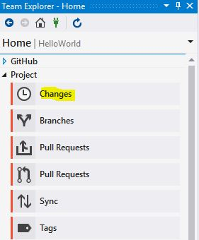
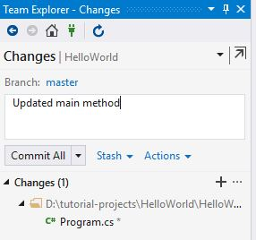
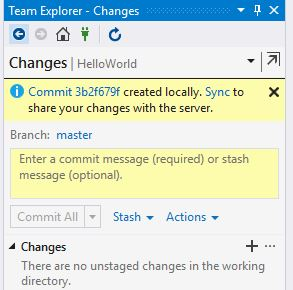
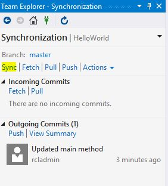
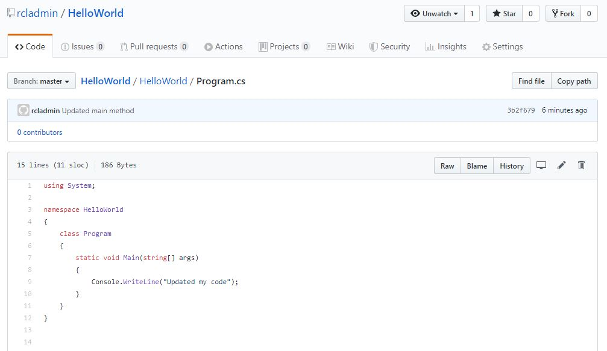

[](https://rclapp.com/bootcamp.html)

****

# Manage Changes

In this lesson, we will manage changes to our code.

## Make Code Changes

- In Visual Studio, make a change to your code :

```java
using System;

namespace HelloWorld
{
    class Program
    {
        static void Main(string[] args)
        {
            Console.WriteLine("Updated my code");
        }
    }
}
```

## Commit Code Changes Locally

- In Team Explorer, click on 'Changes'



- In the 'Changes' window, add a comment for the change and click the **Commit All** button.



## Sync Changes to Remote GitHub repository

- Click the **Sync** link.



- Click the **Sync** link to sync your changes to your remote GitHub repository.



- Ensure your changes is synced with your remote GitHub repository.



****

[](https://rclapp.com/mentors.html)

****

<div id="disqus_thread"></div>
<script>
var disqus_config = function () {
this.page.url = 'https://github.tutorial.rclapp.com/lessons/lesson2.html';
this.page.identifier = 'a02-02'; 
};
(function() { 
var d = document, s = d.createElement('script');
s.src = 'https://coding-skills-io.disqus.com/embed.js';
s.setAttribute('data-timestamp', +new Date());
(d.head || d.body).appendChild(s);
})();
</script>
<noscript>Please enable JavaScript to view the <a href="https://disqus.com/?ref_noscript">comments powered by Disqus.</a></noscript>